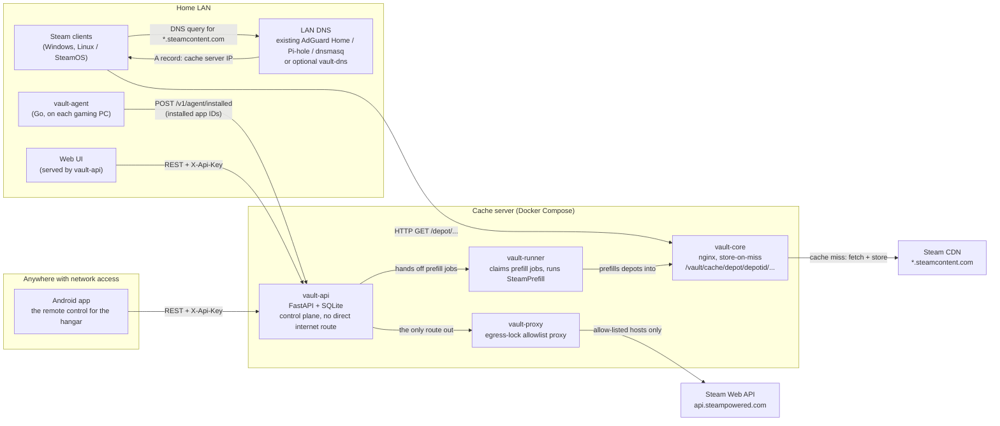

# SteamHangar

A self-hosted, Docker-first Steam LAN download cache with **true per-game
management** — see which game occupies how much space, and delete individual
games from the cache. Built for homelab operators and LAN party organizers.

> SteamHangar is a community project and is not affiliated with Valve
> Corporation. "Steam" is a trademark of Valve Corporation.


*The web interface, running in demo mode — the game names and the gradient
art are invented fixtures (the invented app IDs have no artwork on Valve's
public content-delivery network, so every card falls back to a tile
generated from the ID); what's load-bearing on screen is the "120 owned ·
79 on the cache" count, the per-card size and status badges, the
bypass-detection banner, and the used/free footer.*

## Why this exists

- **The evening you only have two hours.** You want to play, and Steam wants
  to download a 40 GB update first. By default, SteamHangar's scheduler
  checks whatever the vault-agent on your gaming PCs last reported as
  installed, without forcing a full re-download — so by the time you sit
  down, an update that already shipped is often already sitting in the
  cache instead of about to start. And this no longer needs a single
  vault-agent reporting in: the scheduler also keeps every game already
  sitting in the cache current by default (the "keep the cache current"
  mode in the FAQ below), so a guests-only vault with no agent installed
  anywhere still has something for the schedule to check. Either way, the
  two hours you have go into the game, not the progress bar.
- **Wanting a game while you're away from home.** Start the download from
  work or on holiday, and find it ready when you get back. That's what the
  Android app is for — not a dashboard bolted onto the cache, but a remote
  control for the hangar: something a general-purpose LAN cache does not
  offer, because it has no server-side control plane for a phone to reach in
  the first place.
- **The cold cache on LAN-party night.** Preload every game before the
  guests arrive, instead of six people each pulling the same 60 GB from the
  internet at once when the party starts.
- **Cached games going stale silently.** The same scheduled check as above
  keeps refreshing what it already knows about, without you standing over
  it — and, by default, that widens to every game already cached, installed
  or not, so nothing sitting in the vault goes stale just because no PC
  currently reports it installed. (Paired, by default, with actually
  reclaiming the disk space that keeping things current frees up along the
  way — see "The terabyte black box" below and
  [ADR-0014](docs/adr/0014-sweep-cached-and-auto-gc-default-on.md) for why
  the two go together. An operator with a small disk or a headless
  deployment can turn either or both back off — `.env` or one `PATCH
  /v1/settings` call, see that ADR.)
- **The terabyte black box.** See which game takes how much space, and
  delete one game — not all or nothing. This is the core design goal (see
  "Why not just use LanCache?" below for why general-purpose caches can't do
  this cleanly).
- **No tool should need your Steam account.** Credentials never touch this
  software — see architecture decision record
  [ADR-0004](docs/adr/0004-steam-credentials-never-touch-steamvault.md)
  and "Your keys, and where they stop" below for exactly what that means and
  where the boundary actually sits.

## Why not just use LanCache?

[LanCache](https://lancache.net/) is the de-facto standard for LAN caching of
game downloads across multiple services (Steam, Epic, Battle.net, ...), and
it works well for that. SteamHangar is not a replacement or a "LanCache
killer" — it is a **Steam-only, narrower alternative** that trades LanCache's
multi-service breadth for one specific capability LanCache's design can't
offer: because it stores cached files under a generic hashed cache key,
LanCache has no clean way to delete a single game from the cache. Community
tools like `lancache-manager` work around this by parsing access logs after
the fact.

SteamHangar inverts the approach. The Steam content delivery network (CDN)
already encodes the depot ID in the URL (`/depot/<depotid>/chunk/<hash>`), so
storing the cache **path-faithfully** (nginx `proxy_store` instead of
`proxy_cache`) makes the game-to-file mapping part of the directory structure
from day one. Deleting a game means deleting its depot folders — no log
parsing, no key reconstruction, no heuristics.

If you want to cache Epic, Battle.net, or Riot downloads too, use LanCache.
If you only care about Steam and want per-game visibility and cleanup,
SteamHangar is built for exactly that.

## Architecture



### Components

| Component | Role |
|---|---|
| **vault-core** | nginx with `proxy_store` — the cache itself. Path-faithful depot storage, no LRU/eviction (deletion is explicit, by design). |
| **vault-dns** | Optional bundled dnsmasq container for LANs with no existing DNS server. Not needed if you already run AdGuard Home, Pi-hole, dnsmasq, or Unbound. |
| **vault-api** | FastAPI + SQLite control plane: depot→app mapping, per-game size/deletion, scheduler, manifest-based garbage collection, settings, webhooks. Hands prefill work off to vault-runner rather than running it itself, and — see "Your keys, and where they stop" below — has no direct route to the internet. |
| **vault-runner** | Claims prefill jobs handed off by vault-api and actually runs [SteamPrefill](https://github.com/tpill90/steam-lancache-prefill) against the real Steam CDN. Splitting this out of vault-api is what makes the egress lock on vault-api possible: this is the one component that genuinely needs an ordinary route to the internet. |
| **vault-proxy** | The egress lock: a filtering proxy that any outbound call from vault-api's container must pass through, refusing anything not on an allow-list. |
| **vault-agent** | Small Go binary on each gaming PC/Steam Deck. Reports installed app IDs to vault-api — the reporting path is read-only, no control logic on the device. It also has an *opt-in* hosts-file mode that, only when explicitly invoked, writes a managed block into the local hosts file. |
| **Web UI** | Browser single-page application (SPA) served directly by vault-api — no separate deploy step, works over the LAN or a VPN like Tailscale as soon as vault-api is reachable. Shipped: 680 automated tests. |
| **Android app** | Kotlin/Compose app — the remote control for the hangar from "Wanting a game while you're away from home" above. Shipped: 578 automated tests, run so far only on the Java virtual machine (JVM) rather than a real device or emulator — see [Roadmap](#roadmap). |

Full architecture details, the cache storage layout, and the API surface are
in [`docs/PROJECT_PLAN.md`](docs/PROJECT_PLAN.md) (§2–6). Design decisions
that shaped the components above are recorded as ADRs in
[`docs/adr/`](docs/adr/).

## Quickstart (5 minutes)

Prerequisites:

- Docker Engine with Compose v2 (`docker compose`, not `docker-compose`)
- A LAN DNS server you can add a rewrite to (AdGuard Home, Pi-hole, dnsmasq,
  Unbound — or use the bundled `vault-dns` container if you have none)
- Outbound internet access (the cache fetches from the Steam CDN on a miss)

```bash
git clone https://github.com/steamhangar/steamhangar steamhangar
cd steamhangar/deploy
cp .env.example .env
$EDITOR .env                      # set VAULT_API_KEY — the one mandatory value
docker compose up -d --build
```

Check the stack came up (export the key you just set so the curls below can use it):

```bash
export VAULT_API_KEY=<the value you put in deploy/.env>

curl http://<server>/health                     # -> ok                (vault-core)
curl -I http://<server>/lancache-heartbeat       # -> X-LanCache-Processed-By: steamhangar
curl http://<server>:8080/v1/health              # -> {"status":"ok"}  (vault-api)
curl -H "X-Api-Key: $VAULT_API_KEY" http://<server>:8080/v1/games
```

**Security note before you go further:** the defaults above publish
`vault-core` on `0.0.0.0:80` (intentional — every LAN Steam client must reach
it) and `vault-api` on `0.0.0.0:8080`. Never port-forward vault-core to the
internet, and never port-forward vault-api either — reach it from outside
the LAN only via Tailscale/Twingate or your own TLS reverse proxy with
forward-auth on top of the API key. See `docs/PROJECT_PLAN.md` §10,
["Your keys, and where they stop"](#your-keys-and-where-they-stop) below, and
[`docs/security/threat-model.md`](docs/security/threat-model.md) for the full
trust-boundary writeup — what an untrusted device on your LAN can already
do, where credentials actually live, and what this project does not defend
against.

### Point Steam at the cache (pick one DNS mode)

1. **You already run a local DNS server** (recommended): add a rewrite for
   `*.steamcontent.com` → this host's IP, and make sure `AAAA` queries for
   the same zone return no address (`AAAA` is the DNS record type for IPv6,
   the sixth-generation internet protocol — if a lookup for it returns a
   real address, IPv6-capable clients connect straight to Valve over IPv6
   and silently skip the cache, with no error and nothing in any log to
   notice it by). Copy-paste instructions for AdGuard Home, Pi-hole, and
   plain dnsmasq/Unbound are in [`dns/README.md`](dns/README.md).
2. **No local DNS server yet**: enable the bundled dnsmasq container and
   point your router's DHCP-advertised DNS at it:
   ```bash
   # in deploy/.env:
   #   CACHE_IP=192.168.1.50        <- LAN IP of this host
   #   VAULT_DNS_BIND=192.168.1.50  <- publish :53 on that IP only, never 0.0.0.0
   docker compose --profile dns up -d
   ```
3. **Single gaming PC, no DNS server at all**: use vault-agent's opt-in
   hosts-file mode instead (Windows and Linux/SteamOS both work — this mode
   is not Windows-only) — see [`agent/README.md`](agent/README.md).

### One-time SteamPrefill login

SteamPrefill needs a real Steam session, created once, interactively, by you
— vault-api and vault-runner never see, store, or log your Steam credentials
([ADR-0004](docs/adr/0004-steam-credentials-never-touch-steamvault.md)).
SteamPrefill itself runs inside the `vault-runner` container (not
`vault-api` — see the Architecture section above), so that is where the
login has to happen:

```bash
cd deploy
docker compose up -d          # make sure vault-runner is actually running first
docker compose exec -it vault-runner \
    /opt/steamprefill/SteamPrefill select-apps
```

Enter your account name, password, and Steam Guard code when prompted, then
exit the app selector (vault-api overwrites the app selection per job
anyway). The session persists in a dedicated volume and survives restarts
and image upgrades. [`deploy/README.md`](deploy/README.md#first-run-the-one-time-steamprefill-login)
covers the fallback command if you've reconfigured the stack to run
SteamPrefill inside `vault-api` itself instead.

Until you do this, everything else already works (`/v1/games`, the cache
itself) — only prefill jobs are blocked, with an actionable error message.

### Verify it's actually caching

- Install or update any Steam game on a client behind your LAN DNS. The
  first download is a **MISS**: vault-core fetches from the real Steam CDN
  and stores the response path-faithfully under
  `/vault/cache/depot/<depotid>/...` as it streams to the client.
- Delete and reinstall the same game (or install it on a second machine on
  the LAN). This time every chunk already on disk is a **HIT** — served at
  local disk/LAN speed, no *chunk* request reaches the Steam CDN. (Manifest
  requests are small and always go upstream, by design — they carry
  per-request codes and don't dedupe by URL.)
- `curl -H "X-Api-Key: $VAULT_API_KEY" http://<server>:8080/v1/cache/summary`
  shows total cache usage, free disk space, unmapped depots, and the top 10
  consumers once something has been cached; `GET /v1/games` has the
  full per-game breakdown.

Full deployment reference — volumes, backup, log rotation, the port-80/
dedicated-IP story, security posture, and a 185-check verification script —
lives in [`deploy/README.md`](deploy/README.md).

## Android app

The Android app is the remote control for the hangar from "Wanting a game
while you're away from home" above: start a download from work or on
holiday, and find it ready when you get back.

- **Connectivity.** Two ways to reach a vault ship today: a system-VPN
  profile (works over a regular Tailscale app, or any other VPN/LAN route
  you already have to the vault) and a public-domain profile (HTTPS only,
  for a vault reachable at a domain of its own). An embedded Tailscale
  client that would remove the need for a separate VPN app is designed as
  a future profile but not built yet — see [Roadmap](#roadmap).
- **Identity.** Signing in happens on Valve's own "Sign in with Steam" page,
  opened inside the app — the app never sees your password, only the
  resulting Steam identity. Since the app's library fetch moved onto the
  vault relay, **no phone carries a Steam Web API key any more**: one key
  lives entirely server-side, entered once by the operator. See "Your keys,
  and where they stop" below and
  [ADR-0004](docs/adr/0004-steam-credentials-never-touch-steamvault.md)'s
  second addendum for the full boundary and the trade-off accepted to get
  there.
- **Getting it.** There is no Play Store listing. Tagged releases publish a
  signed Android application package (APK) to the project's GitHub
  Releases — see [`app/README.md`](app/README.md) for exactly how. Until
  the first tag is actually pushed, there is nothing there yet to download;
  build it yourself from source in the meantime, using that same README's
  release-signing section.
- **One honest limitation up front.** The app has no offline or demo mode:
  every screen before it can reach a configured vault shows a plain
  "not connected" prompt rather than anything resembling a finished
  product. That is also, plainly, why there are no in-repo screenshots of
  the app yet — there is nothing meaningful to capture from an emulator with
  no vault behind it, and real screenshots need an actual device against a
  real vault.

<!--
Uncomment once the two files below exist in docs/img/:


*The Android app's library view — the app-side counterpart to the web
screenshot above.*


*The Android app's downloads screen mid-download — the "ready when you get
home" promise, made visible.*
-->

## Your keys, and where they stop

Three separate secrets are involved in running SteamHangar, and each one is
contained a different way.

**1. The Steam Web API key.** This key powers the library/cover-art lookup
for both the web UI and the Android app. It is entered exactly once, by the
operator, in the web UI's settings screen, and stored server-side —
**no phone carries a Steam Web API key any more.** Both frontends read
library data through vault-api's own relay instead of calling Valve
directly. This closes a real gap (previously the Android app used its
own, device-local key) at a real, stated cost: through the relay, a
private Steam profile can look identical to a genuinely empty library,
and the app says so honestly rather than guessing. See
[ADR-0004](docs/adr/0004-steam-credentials-never-touch-steamvault.md)'s
addenda for the full boundary and trade-off.

**2. The egress lock.** The container holding that relay's outbound calls
(vault-api) has no default route to the internet at all — reaching
anything beyond the LAN, including Valve's own API, requires passing
through `vault-proxy`, a filtering proxy whose allow-list ships, by
default, as Valve's API and nothing else. That promise lives in the
Docker Compose network topology, not in application code, which means you
can verify it yourself in about 25 lines of `docker compose exec`/`tcpdump`
commands instead of reading the whole project —
[`deploy/README.md`](deploy/README.md#egress-lock-vault-api-loses-its-default-route-out)
walks through exactly that. **Two channels stay open on purpose, named here
rather than left for you to discover:** DNS lookups from inside that
container still reach the real internet (the resolver Docker uses runs in
the host's own network namespace, not the container's, so a process that
controls what hostname it looks up controls what leaves inside that name);
and the Docker host's own published addresses — vault-core's port, for
one — stay directly reachable regardless of the lock, because a reply from
the host to a container needs no network address translation. Neither
channel lets vault-api reach an arbitrary device on your LAN or the
internet, which is the actual guarantee the lock makes; see
[ADR-0011](docs/adr/0011-egress-lock.md) and the threat model for the full
reasoning behind leaving both open rather than overstating what's closed.

**3. The vault's own API key.** Every vault-api route that returns or
changes data requires an `X-Api-Key` header matching `VAULT_API_KEY` — one
shared secret, set once in `.env`, never committed and never present in
`compose.yaml`. The one exception besides the health check is the web UI's
own static files (its `index.html`, its JavaScript, its CSS): reaching
those needs no key, because the UI shell itself isn't API data — but every
API call that JavaScript then goes on to make still needs the key, exactly
like a call you'd make yourself. If a vault has one operator and should
stay that way, `VAULT_SETTINGS_READONLY` locks the settings screen
entirely; that variable went unforwarded by the same work that first
packaged the web UI into the vault-api image, a gap later found and closed,
so the compose file you get by default now forwards it rather than needing
one wired up by hand.

## FAQ

**Does this work for guests, without installing anything?**
Yes — that's the point. Any Steam client on the LAN that resolves
`*.steamcontent.com` to this cache server (because of the DNS rewrite) is
served automatically: no account, no vault-agent install, no app, zero
per-device setup. Because vault-core stores on the first miss
([ADR-0001](docs/adr/0001-proxy-store-feasibility.md)), the very first
guest's download already fills the cache for everyone downloading the same
game afterward — nobody has to be "first" on purpose.

**What about clients that bypass the cache (IPv6, DNS-over-HTTPS)?**
DNS-based redirection only works if the client actually asks *your* DNS
server and only for the record types you've overridden. If your resolver
still forwards `AAAA` queries (the IPv6 lookup — see the DNS section above)
for `*.steamcontent.com` upstream, IPv6-capable clients will silently
connect straight to Valve over IPv6 — no error, no log entry, the cache
just never gets used for that client. `dns/README.md` documents closing
this for every common resolver. Per-client bypass detection is shipped:
`GET /v1/clients` (surfaced in both the web UI and the Android app) groups
clients into bypassing/healthy, and it fails toward *not* accusing a
client — a false accusation is treated as worse than a missed one. A
client that uses Steam's own LAN peer-to-peer transfers instead of the
cache is expected and not a bypass.

**Can I delete just one game from the cache?**
Yes — this is the core design goal. `DELETE /v1/cache/{appid}` removes that
app's depot folders. Depots shared between multiple tracked games are
detected and protected from deletion while any co-owning game still has
cached content (see `docs/PROJECT_PLAN.md` §4).

**What happens when a game updates — does the cache go stale?**
The primary check is a scheduled SteamPrefill run *without* `--force`
([ADR-0006](docs/adr/0006-staleness-via-nonforced-prefill.md)):
SteamPrefill's own up-to-date bookkeeping makes this a ~3-second,
zero-download no-op for an app that's already current, and a real (but
minimal — only the changed chunks) fetch when it isn't; by default, that
sweep widens to include cached-but-not-installed games too — a game with
nobody currently reporting it installed still gets kept current
([ADR-0014](docs/adr/0014-sweep-cached-and-auto-gc-default-on.md), an
operator can opt back out). Between sweeps, an optional, opt-in third-party
manifest oracle (`VAULT_MANIFEST_ORACLE`, off by default) already ships as
a backend feature that can answer "is this stale right now" without
waiting for the next sweep — but neither frontend renders its answer as a
badge yet, so today that's a capability you can query over the API, not
something you'll see on screen. Garbage collection (**GC**: clearing out
the chunks a game update leaves behind that no cached version of the game
needs any more) reclaims that orphaned space via
`POST /v1/cache/{appid}/gc`, diffing cached chunks against the current
manifest rather than guessing by file age. Manual calls to that endpoint
are **dry-run by default at every layer**; deleting anything through it
requires the explicit opt-in `{"execute": true}`
([ADR-0007](docs/adr/0007-manifest-diff-gc.md)). The *automatic* GC that
runs after a scheduled prefill actually updates something is a separate
setting (`VAULT_AUTO_GC`) that now defaults to `execute` — paired with the
cached-sweep default above so keeping the cache current doesn't quietly
grow it forever; see ADR-0014 for that pairing and how to turn it back to
`dry-run`/`off`.

**Is my Steam account safe?**
SteamHangar's own components never see your Steam password. The one-time
SteamPrefill login happens interactively in your own terminal (inside the
`vault-runner` container). Signing in to the web UI or the Android app both
use Steam's own "Sign in with Steam" OpenID flow against Valve's login
page — the credential never passes through anything in this repository.
Library data for both frontends is fetched through vault-api's own opt-in
relay using one operator-entered key, never each user's own — see "Your
keys, and where they stop" above for exactly what that buys you and what it
costs ([ADR-0004](docs/adr/0004-steam-credentials-never-touch-steamvault.md)).

## Status

Backend and both frontends are shipped and tested. What's left is
publication and community announcement — see [Roadmap](#roadmap) below. See
[`docs/PROJECT_PLAN.md`](docs/PROJECT_PLAN.md) §7 for the authoritative,
continuously updated checklist that this table and the roadmap are drawn
from.

| Phase | What it covers | Status |
|---|---|---|
| 0 — Feasibility proof of concept | Validate path-faithful storage against real Steam traffic | Done |
| 1 — vault-core + vault-api minimum viable product (MVP) | Cache core, API skeleton, prefill orchestration, size/deletion, Docker Compose | Done |
| 2 — vault-agent | Windows + Linux/SteamOS PC listener, hosts-file mode, task/service packaging | Done |
| 3 — Scheduler & update logic | Staleness detection, manifest-based garbage collection, job pause/cancel, per-client bypass detection, webhooks | Done |
| 4a — Web UI | Browser single-page application served by vault-api | Done — 680 automated tests |
| 4b — Android app | Kotlin/Compose app with system-VPN and public-domain connectivity profiles | Done — 578 automated tests (JVM-only; see Roadmap) |
| 5 — Community release | README, license, continuous integration, security policy & threat model | Nearly done — publication and announcement remain |

## Roadmap

What's genuinely still open, mined from `docs/PROJECT_PLAN.md` §7 rather
than guessed — nothing here is implemented yet, and nothing above claims
otherwise:

- **An embedded Tailscale client inside the Android app itself (`tsnet`).**
  The app already reaches a vault over a regular Tailscale app installed
  separately on the phone today (the system-VPN connectivity profile
  covers this); folding Tailscale's own userspace client directly into the
  app, so that separate app is no longer needed, is designed as an
  additive profile but not built.
- **Instrumented Android tests.** All 578 Android tests run on the JVM;
  none have run yet against a real device or emulator, including the
  release-signing path.
- **Download speed throttling, possibly time-dependent.** Nothing in the
  stack limits how fast SteamHangar pulls from Steam today; the shipped
  night window (03:00-07:00 local, [ADR-0014](docs/adr/0014-sweep-cached-and-auto-gc-default-on.md))
  confines *when* the bulk downloads run, not *how fast*. Planned: a
  bandwidth cap on the upstream (Steam → vault) direction — the WAN side
  is the scarce resource; serving the LAN should stay at wire speed —
  optionally varying by time of day (full speed inside the night window,
  capped outside it, e.g. for a daytime "I want this game tonight"
  prefill). Open design questions: whether SteamPrefill exposes a native
  concurrency/rate knob or the limit belongs at the container level, and
  how a cap interacts with the window scheduler. Until then, per-device
  QoS on the router covers the same need without any code.
- **The web UI's own still-open validation list:** real screen-reader
  testing, how cover art actually renders on a phone browser, and
  performance at a much larger library size than has been tested so far —
  none blocking, all honestly unverified rather than assumed fine.
- **External integrations beyond the generic webhook already shipped:**
  delivering to several webhook targets at once instead of exactly one,
  native Discord/Slack payload formats (Discord currently needs a relay in
  between, since it rejects the generic JSON envelope outright), named API
  keys scoped to read / enqueue / destructive actions instead of one key
  for everything, structured log export for external log-aggregation
  tools, and per-target payload scoping so a shared notification channel
  doesn't have to see every device's IP address.
- **Publication and announcement.** A pre-release security review (waiting
  on an application code freeze), publishing container images, and the
  actual announcement — framed as a complement or alternative, never a
  "LanCache killer" — still need to happen, in that order.

## More documentation

- [`docs/PROJECT_PLAN.md`](docs/PROJECT_PLAN.md) — vision, requirements, full
  architecture, phase plan, deployment notes, and open risks
- [`docs/adr/`](docs/adr/) — architecture decision records: feasibility,
  Linux/SteamOS agent scope, depot mapping, credentials, agent language,
  staleness, garbage collection, the cache-event feed, persisted settings,
  the relay privacy gate, the egress lock, the prefill-runner split, the
  product rename to SteamHangar, and the cached-sweep/auto-GC default-on
  decision
- [`core/README.md`](core/README.md) — vault-core (nginx cache) internals
- [`api/README.md`](api/README.md) — vault-api endpoints, schema, and
  configuration
- [`agent/README.md`](agent/README.md) — vault-agent build, install, and
  hosts-file mode
- [`dns/README.md`](dns/README.md) — vault-dns and DNS rewrite instructions
  for AdGuard Home / Pi-hole / dnsmasq / Unbound
- [`deploy/README.md`](deploy/README.md) — full deployment reference,
  including ["Egress lock"](deploy/README.md#egress-lock-vault-api-loses-its-default-route-out) —
  vault-api's container has no default route to the internet, with a
  five-minute recipe to verify that yourself
- [`docs/security/threat-model.md`](docs/security/threat-model.md) — the
  trust boundary, the cache contents, where credentials actually live, the
  personal-data surface, outbound data flows, and what this project
  deliberately does not defend against, cited by file/line against shipped
  code
- [`SECURITY.md`](SECURITY.md) — how to report a vulnerability privately

## License

**Apache-2.0** — permissive, includes a patent grant, chosen deliberately
over AGPL to keep the barrier low for contributors and companies alike
(see `docs/PROJECT_PLAN.md` §7, Phase 5 and [`LICENSE`](LICENSE)).
Contributions are accepted under the same license — see
[`CONTRIBUTING.md`](CONTRIBUTING.md).
